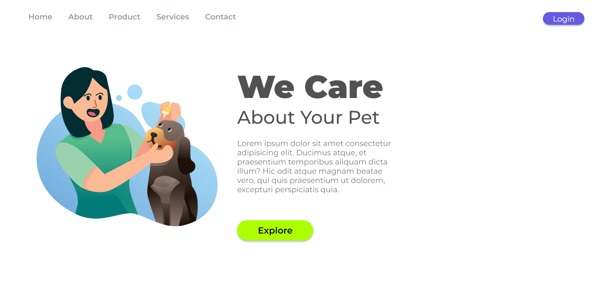

# P-1-We-Care-Dev-Club
# 🐾 We Care - Landing Page



## 📌 Sobre o Projeto
O **We Care** é uma landing page desenvolvida para apresentar uma marca fictícia de cuidados com pets.  
O objetivo do projeto é treinar **HTML5** e **CSS3**, aplicando boas práticas de responsividade, tipografia e organização visual.

A interface é minimalista e moderna, com navegação simples e destaque para **call-to-action** de login e exploração de produtos/serviços.

---

## 🚀 Tecnologias Utilizadas
- **HTML5** → Estrutura do projeto  
- **CSS3** → Estilização e responsividade  
- **Google Fonts** → Tipografia moderna (Montserrat, Poppins, Roboto, League Gothic, Modak)

---

## 📂 Estrutura de Pastas
```bash
P-1-We-Care-Dev-Club/
│── index.html        # Estrutura principal
│── styles.css        # Estilos e responsividade
│── Img/              # Imagens do projeto
│── README.md         # Documentação
